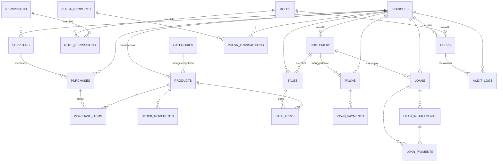

# ERD & Desain Database — POS Multi Usaha

Skema lengkap ada di [`database/schema.sql`](../database/schema.sql) dan data awal di
[`database/seed.sql`](../database/seed.sql). Seluruh tabel menggunakan **InnoDB**
(mendukung `FOREIGN KEY` dan transaksi) dan `utf8mb4`.

## Diagram Relasi (ERD)

## Ringkasan Tabel

| Tabel | Fungsi |
|---|---|
| `branches` | Master cabang usaha |
| `roles`, `permissions`, `role_permissions` | RBAC — hak akses per role |
| `users` | Akun pengguna (super admin/admin cabang/kasir) |
| `categories`, `products`, `stock_movements` | Master & mutasi stok aksesoris HP |
| `suppliers`, `purchases`, `purchase_items` | Pembelian barang ke stok |
| `customers` | Pelanggan lintas modul (penjualan, gadai, pinjaman) |
| `sales`, `sale_items` | Transaksi penjualan aksesoris (POS) |
| `pulsa_products`, `pulsa_transactions` | Produk & transaksi pulsa/paket data |
| `pawns`, `pawn_payments` | Gadai barang & pembayaran bunga/tebusan |
| `loans`, `loan_installments`, `loan_payments` | Pinjaman uang & angsuran |
| `audit_logs` | Jejak audit seluruh aksi penting |
| `settings` | Pengaturan sistem (key-value) |

## Prinsip Desain

- **Multi cabang**: hampir semua tabel transaksi punya `branch_id`. Data yang
  sifatnya lintas cabang (role, permission, produk pulsa) tidak diberi `branch_id`.
- **Soft delete**: tabel master (`branches`, `users`, `products`, `categories`,
  `suppliers`, `customers`) memakai kolom `deleted_at` — data tidak pernah
  dihapus permanen dari basis data demi jejak audit dan integrasi laporan historis.
- **Histori harga & laba**: `sale_items` menyimpan `price` dan `cost_price` pada
  saat transaksi terjadi (bukan mengambil ulang dari `products`), sehingga
  laporan laba tetap akurat walau harga produk berubah di kemudian hari.
- **Stok**: setiap perubahan stok (pembelian, penjualan, pembatalan, penyesuaian
  manual) dicatat di `stock_movements` sebagai jejak audit stok, terpisah dari
  nilai `stock_qty` pada tabel `products` yang menyimpan saldo terkini.
- **Transaksi database**: operasi yang mengubah beberapa tabel sekaligus (mis.
  membuat penjualan + item + stok) dibungkus `PDO::beginTransaction()` /
  `commit()` / `rollBack()` di layer Model agar konsisten (ACID).
